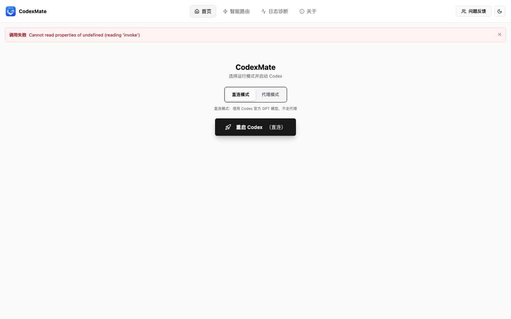
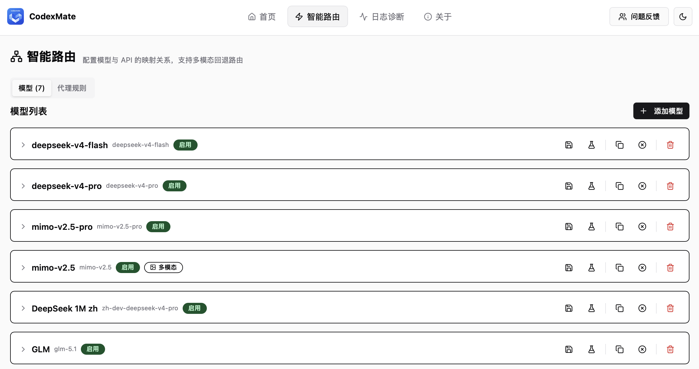
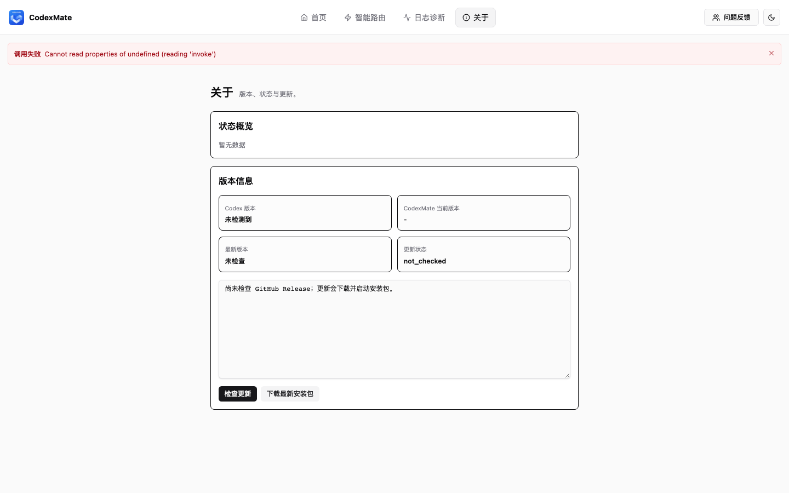

<h1 align="center">CodexMate</h1>

<p align="center">
  <b>English</b> · <a href="./README.md">中文</a>
</p>

<p align="center">
  
  
  
  
</p>

<p align="center">
  A local enhancement manager for Codex — GUI management · Smart routing · Model aggregation · Diagnostics
</p>

---

## ✨ Features

- **Smart Routing** — Manage providers, model mappings, fallbacks, and multimodal fallback strategies through a visual interface
- **Multi-Provider Aggregation** — Unify OpenAI, DeepSeek, local models, and more into a single model picker; switch freely
- **Protocol Adapter** — Compatible with `Responses API`, `Chat Completions`, and third-party endpoints
- **Codex Injection** — Enhance Codex via CDP injection scripts without modifying the Codex app itself
- **Mode Switching** — Toggle between direct and proxy modes and restart with one click
- **Logs & Diagnostics** — View runtime logs, export diagnostic reports, and troubleshoot quickly

> CodexMate is not a replacement for Codex. It is a local companion tool built around Codex.

---


<p align="center">
  
  <br>
  <em>CodexMate main interface — quick launch and management</em>
</p>

<p align="center">
  
  <br>
  <em>Smart routing — manage providers and model mappings</em>
</p>

<p align="center">
  
  <br>
  <em>About — version info and update check</em>
</p>


## 📥 Installation

Download the latest `.dmg` from [Releases](https://github.com/Jasoncasper/CodexMate/releases):

```bash
# Or via Homebrew (coming soon)
# brew install codexmate
```

**Requirements**: macOS 12+

---

## 🚀 Quick Start

1. Download and install CodexMate
2. Launch the app — the management UI opens automatically
3. Add your model providers (OpenAI / DeepSeek / custom, etc.) on the **Routing** tab
4. Manage MCP servers, Skills, and Plugins on the **Context** tab
5. Click **Launch Codex** in the top bar to start using

---

## 🔧 Building from Source

### Prerequisites

- macOS 12+
- Rust stable
- Node.js 20+ & npm 10+
- Xcode Command Line Tools

### Steps

```bash
# 1. Clone the repository
git clone https://github.com/Jasoncasper/CodexMate.git
cd CodexMate

# 2. Install frontend dependencies and start dev mode
cd apps/codexmate-manager
npm install
npm run dev
```

### Common Checks

```bash
cd apps/codexmate-manager
npm run check                           # TypeScript type checking

cd /path/to/CodexMate
cargo check --workspace                 # Rust compilation check
cargo test -p codexmate-manager --lib   # Run tests
```

### Building a Release

```bash
cd apps/codexmate-manager
npm run build
```

Artifacts will be at:

- `target/release/bundle/macos/CodexMate.app`
- `target/release/bundle/dmg/CodexMate_<version>_<arch>.dmg`

---

## 📁 Repository Structure

```
CodexMate/
├── apps/
│   ├── codexmate-launcher/     # Background launcher (Rust)
│   └── codexmate-manager/      # Tauri management UI (React + Rust)
├── crates/
│   ├── codexmate-core/         # Core: routing, injection, update, diagnostics
│   └── codexmate-data/         # Data & export capabilities
├── assets/                     # Static assets (injection scripts, images, etc.)
├── scripts/                    # Build & release scripts
└── docs/                       # Documentation
```

---

## 🤝 Contributing

Issues and PRs are welcome. See [CONTRIBUTING.md](./CONTRIBUTING.md).

---

## 📄 License

This project is licensed under the MIT License — see [LICENSE](./LICENSE).
